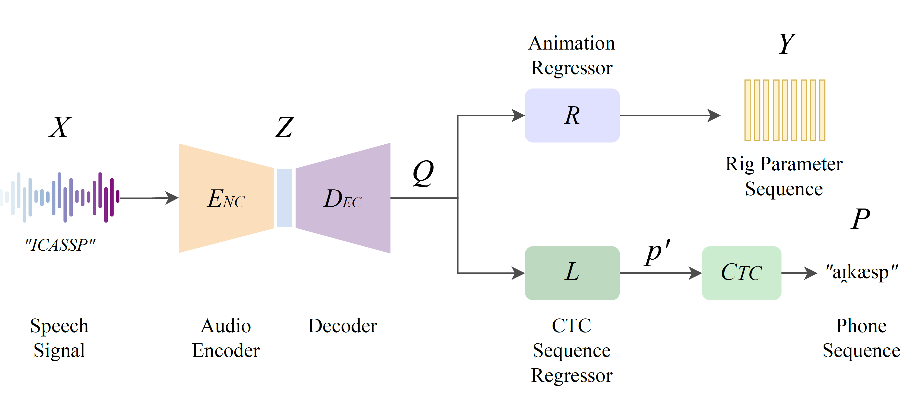
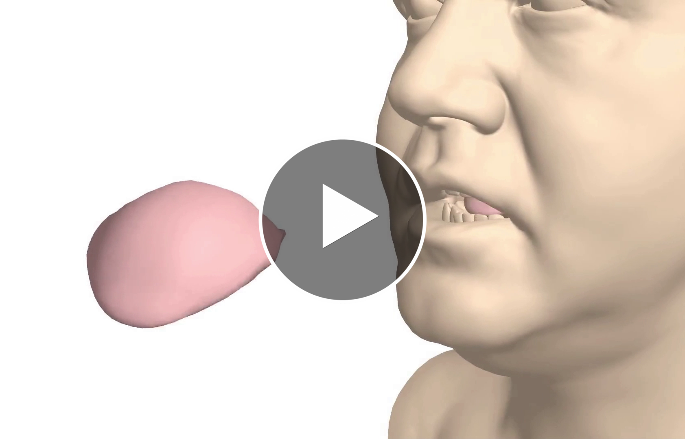

# PhISANet
### Phonetically Informed Speech Animation Network

## Abstract

As digital avatars become more prevalent, realistic animation is crucial for immersive and seamless human-avatar interactions. This work presents PhISANet, an encoder-decoder model that animates the face and tongue solely from speech. PhISANet leverages neural audio representation models trained on vast amounts of speech data to map the speech signal into animation parameters that control the lower face and tongue of a realistic 3D model. By integrating a novel multi-task learning CTC during the training phase, PhISANet reincorporates the phonetic information from the input speech, improving articulation in the generated animations. A thorough quantitative and qualitative analysis validates this improvement, and it determines that WavLM and Whisper features are ideal for training a generalizable speech-animation model regardless of gender, age, and language.

## Media

  

